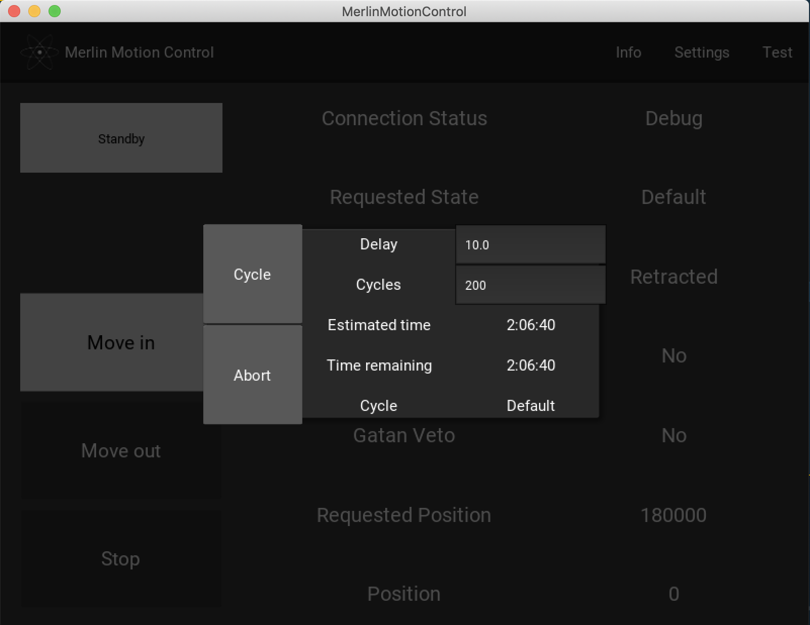
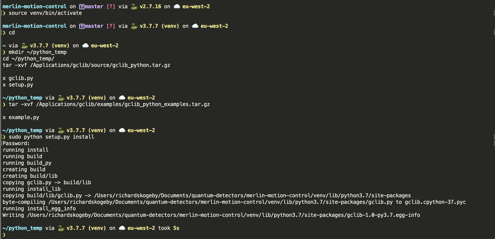

# Merlin Motion Control

Interlock and controller for MerlinEM DMC.

## About

The Merlin Motion Control app is used in conjunction with Quantum Detector's retractable Merlin detectors and the MotionPod interlock unit from MotionLink.

## Requirements

* Anaconda 3
* Kivy 1.11.1
* Gclib for Python 3

## Usage

In the main interface you have access to all the relevant status fields and buttons for safely controlling your retractable Merlin detector using the MotionPod from MotionLink.

<div align="center">

</div>

The main window has control buttons for Standby, Move in, Move out and Stop commands; and fields displaying the current status of the MotionLink system. In the actionbar ther are buttons for Info and Settings.


<div align="center">

</div>

Settings window with advanced settings that can be adjusted and saved for the current session. On exit these settings are disregarded, and the default ones are loaded on relaunching the application.

<div align="center">

</div>

Info window with name of software, version and copyright notice.

<div align="center">

</div>

Test window for running cycle tests. Delay specifies the time Merlin waits at the end positions in seconds('Retracted' and 'Inserted'); Cycles the number of insert and retract cycles it will do before stopping; Estimated time is calculated in two steps: 1. Before the cycle test has started, based on the speed specified to the controller of the stepper motor (See the Speed and Speed out parameters in the  settings window.), the requested position and lastly the given Delay, 2. After the first cycle, by measuring the time to complete one cycle. The two estimates differ because of the overshoot when retracting the Merlin. This overshoot is necessary to allow the Merlin to recalibrate its position, so its position doesn't change over time. Time remaining counts down from the estimated time. After the correction by the secone time estimate, it corrects itself to count down from the time estimated for _Cycles = Cycles - 1_.

The button Cycle sets a running flag to True and enters a loop managing the insertions and retractions. The insert and retract commands are identical to those sent by pressing "Move in" and "Move out" in the main window. The abort button changes the running flag to False, and Request State is changed to "Cycle Test Aborted", after which the cycle test will abort and the countdown timer will stop upon completion of the current cycle.

The test window can be closed and reopened while the test is running.

### Buttons
* Standby: Moves the detector in to the standby position.
* Move in: Moves the detector in to the requested position.
* Move out: Moves the detector out. When it reaches position 0 a stop command is issued. The detector will temporarily be at a negative position, but adjust itself back to 0 before its current state is changed to retracted.
* Stop: Stops any ongoing movement of the detector and changes the current state to 'Stopped', upon which the detector can't be moved in. Move Out needs to be clicked before Move In can be used again.

### Status fields
* Requested State / Current State:
    *'Stopped' if the Stop button has recently been pressed.
    *'Moving' if a requested move in/move out or standby request has not been completed.
    *'Inserted' if no other command is issued after 'Move in', and Requested Position and Position are equal.
    *'Retracted' if no other command is issued after 'Move out' and Position equals 0.
* Gatan In: Value read from the MotionLink unit based on interlock set up.
    *'Yes': If the Gatan detector is inserted into the detector chamber.
    *'No': If the Gatan detector is out.
* Gatan Veto:
    *'Yes': If the interlock has been activated.
        * If Merlin is retracted and the Gatan detector is in: If the 'Move In' button is pressed the Merlin remains retracted.
        * If Merlin is moving and then the Gatan is inserted: The interlock overrides the insertion of the Gatan detector, moves the Merlin out until its current state is 'Retracted', then moves the Gatan detector in.
        * If Merlin is inserted and then the Gatan is inserted: Interlock override Gatan and keeps it out while retracting the Merlin. When Merlin is 'Retracted' the Gatan moves in.
* Requested Position: 3200 units equals 1 mm. This is the distance to which you want to insert the Merlin relative its retracted position. The default requested position can be set in the settings.json file. There is a hard limit to the maximum value you can set. If you try and assign a higher value than that of the maximum value the program will automatically override your input.
* Position: The current position relative the retracted position. 3200 units equals 1 mm.

## Installation
Create a virtual environment (for compatibility reasons, if on MacOS install python3 using Homebrew, do not use  `/usr/bin/python3`).

```zsh
python3 -m venv venv
```

Source the venv

```zsh
source venv/bin/activate
```

If on Windows, depending on the shell, the sourcing is done using either `.\venv\Scripts\activate.bat` or `./venv/Scripts/Activate.ps1`.

Install [gclib](http://www.galil.com/sw/pub/all/doc/gclib/html/installation.html) and follow Python setupß instructions under [Language Support > Python](http://www.galil.com/sw/pub/all/doc/gclib/html/python.html). Note you will have to carry out the setup instructions while in the virtual environment of merlin-motion-control. For example



Also note, that on MacOS, creating the environment variable `DYLIB_LIBRARY_PATH` is not optional for this usage. See Galil's instructions on creating it.

With gclib set up for use as a package in Python, navigate to your `merlin-motion-control` directory and install the last of the requirements (still in your virtual environment)

```zsh
pip install -r requirements.txt
```

At this stage you can start the application by running

```zsh
python Merlin_Motion_Control.py
```

On MacOS retina displays the GUI, as of now scales differently to that on Windows or an external monitor. The GUI is drawn on startup, so if it starts up on a non-retina monitor it will scale as it does on Windows.

## Contributing

Please refer to each project's style and contribution guidelines for submitting patches and additions. In general, we follow the ["fork-and-pull" Git workflow](https://gist.github.com/Chaser324/ce0505fbed06b947d962).

* Fork the repo on GitHub
* Clone the project to your own machine
* Commit changes to your own branch
* Push your work back up to your fork
* Submit a Pull request so that we can review your changes

NOTE: Be sure to merge the latest from "upstream" before making a pull request!

## License
[GPL-3.0](https://choosealicense.com/licenses/gpl-3.0/)
