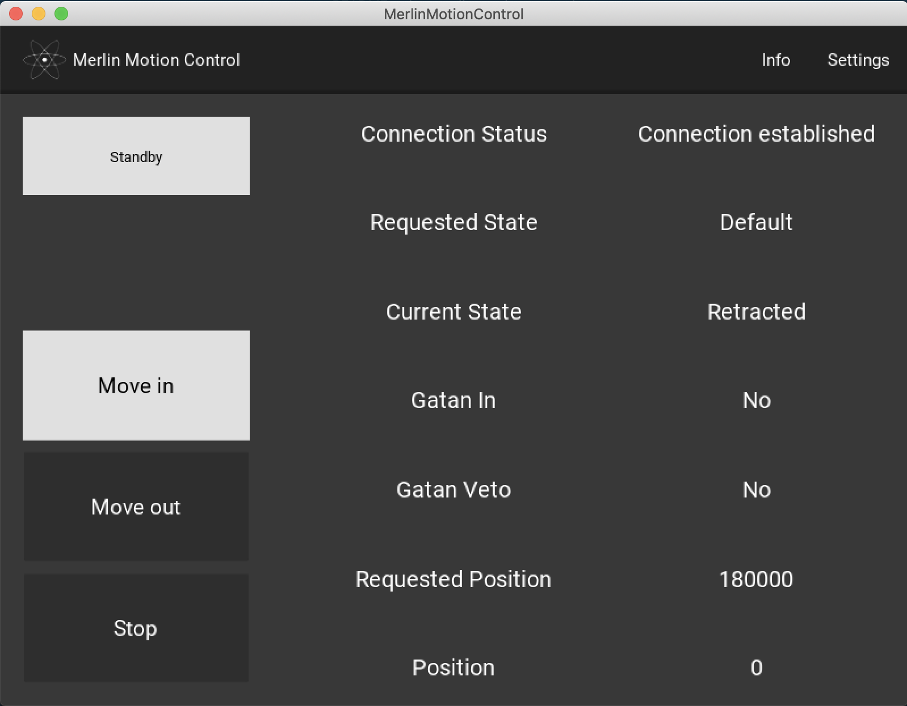
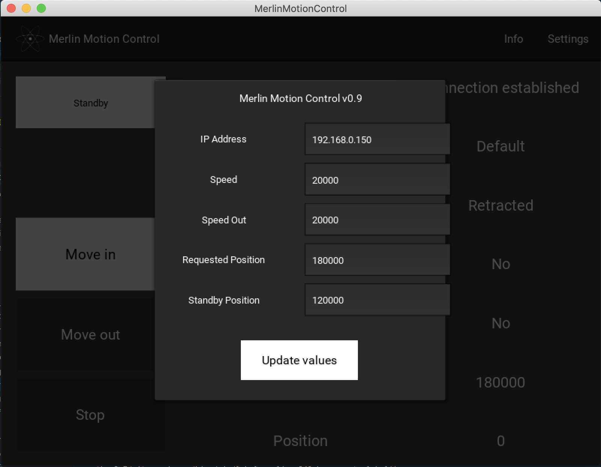
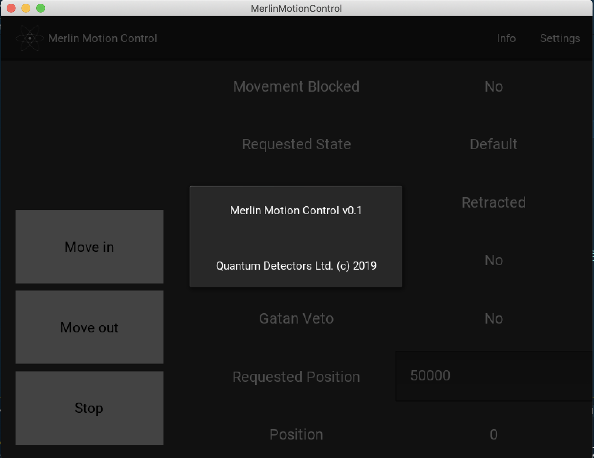

# Merlin Motion Control

This is a beta version of the Merlin Motion Control. Interlock and controller for MerlinEM DMC.

## About

The Merlin Motion Control app is used in conjunction with Quantum Detector's retractable Merlin detectors and the MotionPod interlock unit from MotionLink.

## Requirements

- Anaconda 3
- Kivy 1.11.1
- Gclib for Python 3

## Usage

In the main interface you have access to all the relevant status fields and buttons for safely controlling your retractable Merlin detector using the MotionPod from MotionLink.

<figure>

<figcaption>**Figure 1.** Main window with Standby, Move in, Move out and Stop control buttons; Info and Settings actionbar buttons; and fields displaying the current status of the MotionLink system.</figcaption>
</figure>

<figure>

<figcaption>**Figure 2.** Settings window with advanced settings that can be adjusted and saved for the current session. On exit these settings are disregarded, and the default ones are loaded on relaunching the application.</figcaption>
</figure>

<figure>

<figcaption>**Figure 3.** Info window with name of software, version and copyright notice.</figcaption>
</figure>

### Buttons
- Move in: Moves the detector in. When it reaches the requested position a stop command is sent to the MotionLink unit. When the current state is 'Stopped', 'Move In' is interlocked to prevent accidentally moving the detector in further. The actual position it will reach is speed and clock frequency dependent, and slower speeds imply a higher degree of accuracy. At a speed of 20000 units per second, expect a 500-1000 difference in requested position and actual position. The clock speed is hard coded and is not accessible to the user. 3200 units equals 1 mm in lateral displacement of the Merlin.
- Move out: Moves the detector out. When it reaches position 0 a stop command is issued. The detector will temporarily be at a negative position, but adjust itself back to 0 before its current state is changed to retracted.
- Stop: Stops any ongoing movement of the detector and changes the current state to 'Stopped', upon which the detector can't be moved in. Move Out needs to be clicked before Move In can be used again.

### Status fields
- Requested State / Current State:
    -'Stopped' if Stop button has recently been pressed, and no Move Out has been issued since.
    -'Moving' if position is changing.
    -'Inserted' if position is stable and greater than 0.
    -'Max Insertion' if position is stable and greater than or equal to the maximum allowed position.
    -'Retracted' if position is stable and equal to 0.
- Gatan In: Value read from the MotionLink unit based on interlock set up.
    -'Yes': If the Gatan detector is inserted into the detector chamber.
    -'No': If the Gatan detector is out.
- Gatan Veto:
    -'Yes': If the interlock has been activated.
        - If Merlin is retracted and the Gatan detector is in: If the 'Move In' button is pressed the Merlin remains retracted.
        - If Merlin is moving and then the Gatan is inserted: The interlock overrides the insertion of the Gatan detector, moves the Merlin out until its current state is 'Retracted', then moves the Gatan detector in.
        - If Merlin is inserted and then the Gatan is inserted: Interlock override Gatan and keeps it out while retracting the Merlin. When Merlin is 'Retracted' the Gatan moves in.
- Requested Position: 3200 units equals 1 mm. This is the distance to which you want to insert the Merlin relative its retracted position. The default requested positin can be set in the settings.json file. There is a hard limit to the maximum value you can set. If you try and assign a higher value than that of the maximum value the program will automatically override your input.
- Position: The current position relative the retracted position. 3200 units equals 1 mm.

## Contributing

## License
[MIT](https://choosealicense.com/licenses/mit/)
